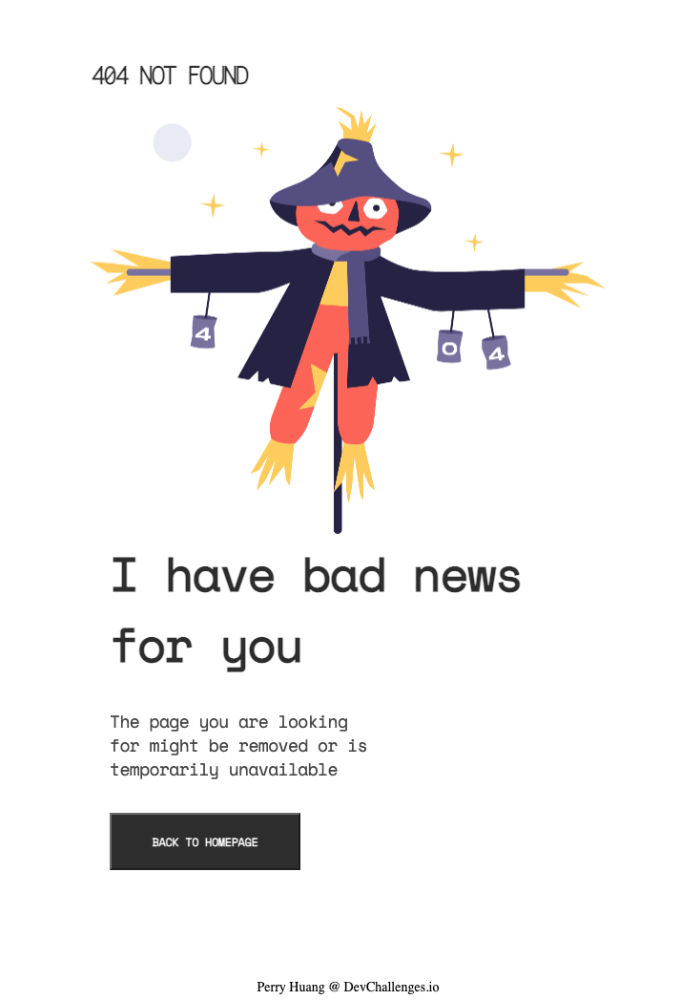

<!-- Please update value in the {}  -->

<h1 align="center">Scarecrow 404 Not Found Page</h1>

  <h3>
    <a href="https://perryfhuang.github.io/404-not-found-master/">
      Deployed Site
    </a>
     | 
    <a href="https://devchallenges.io/challenges/wBunSb7FPrIepJZAg0sY">
      Link to Original Challenge
    </a>
  </h3>

<!-- TABLE OF CONTENTS -->

## Table of Contents

- [Overview](#overview)
  - [Built With](#built-with)
- [Features](#features)
- [Contact](#contact)

<!-- OVERVIEW -->

## Overview

Desktop

Mobile

A static 404 Not Found Page to practice responsive web design (vanilla HTML5, CSS, CSS Grid)

[Live Site](https://perryfhuang.github.io/404-not-found-master/)

### Built With

- HTML5
- CSS
- CSS Grid

## Features

This site was created as a submission to a [DevChallenges](https://devchallenges.io/challenges) challenge. The [challenge](https://devchallenges.io/challenges/wBunSb7FPrIepJZAg0sY) was to build an application to complete the given user stories.

## Contact

- Portfolio Website [https://perryfhuang.github.io/](https://perryfhuang.github.io/)
- GitHub [@perryfhuang](https://github.com/perryfhuang)
- LinkedIn [@yerryfhuang](https://www.linkedin.com/in/perryfhuang/)
